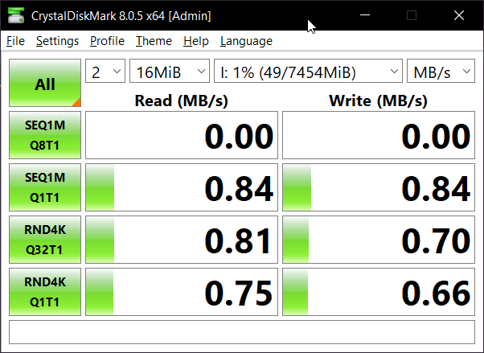

# DMA eMMC USB mass storage class device demo STM32L476RET6

IMPORTANT: Clock is configured for a 16 MHz crystal.

Example of how to use the SDIO/SDMMC peripheral in 4-bit wide mode with USB mass storage class with DMA transfers.

Read my post about setting this up on my website:
[https://www.petertanner.dev/posts/Debugging-STM32-USB-Mass-Storage-Class-Device/](https://www.petertanner.dev/posts/Debugging-STM32-USB-Mass-Storage-Class-Device/)

## Example benchmark

_Wow this performance is terrible... but at least I got it working or something_

